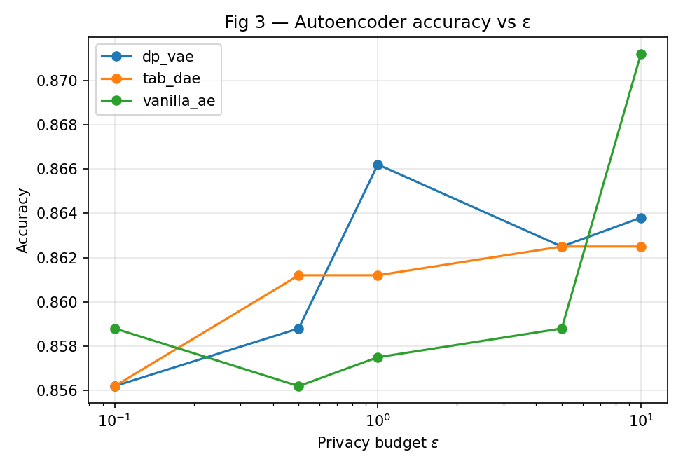
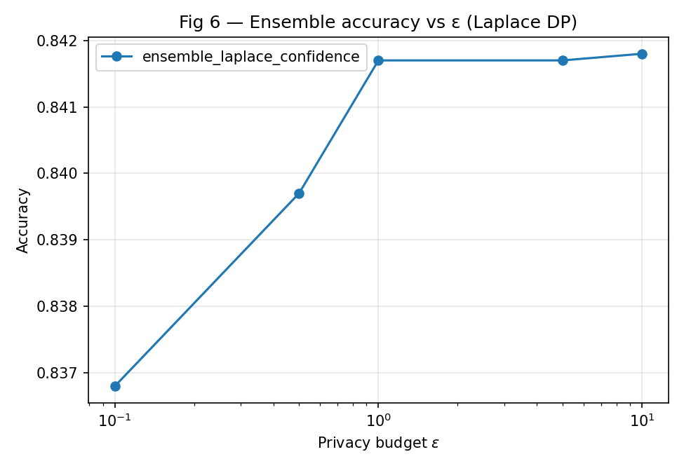
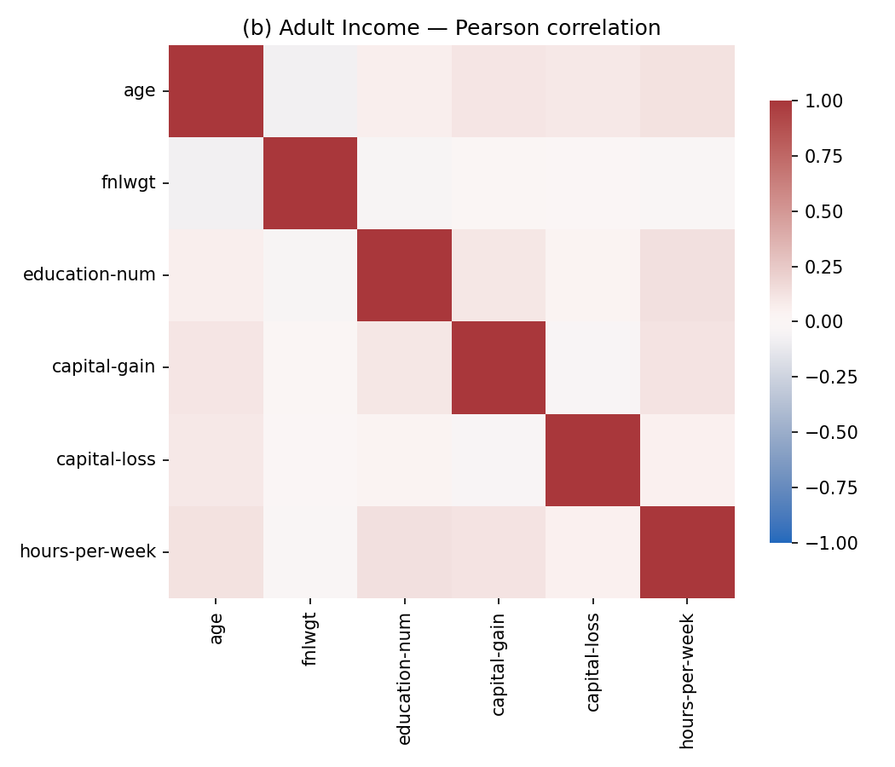
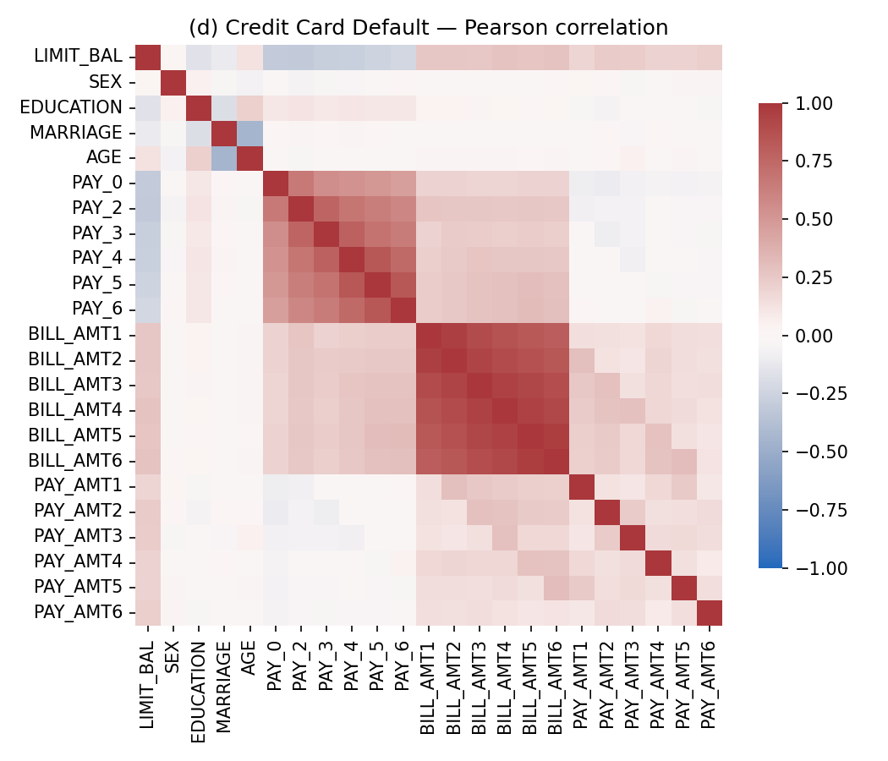

<div align="center">

# 🔐 Unified Privacy-Preserving Learning

### Differential Privacy · Latent Anonymization · Ensemble Aggregation

[](https://www.python.org/)
[](https://pytorch.org/)
[](https://opacus.ai/)
[](LICENSE)
[](https://ieeexplore.ieee.org/xpl/conhome/1001858/all-proceedings)

<br/>

> **A complete, runnable implementation of the research paper:**
>
> *"Unified Privacy-Preserving Learning via Differential Privacy, Latent Anonymization, and Ensemble Aggregation"*
>
> Bhatia R., Chaurasia S., **Painuly A.**, Nirban H. S., Bhatia A. — ICOIN Submission #1571205095

</div>

---

## 📌 What Is This?

This repository provides a **full end-to-end implementation** of a novel privacy-preserving machine learning framework that unifies three independent research threads under a **single, composable privacy budget (ε)**:

| Component | What it does |
|---|---|
| **Sensitivity-Aware Preprocessing** | Splits features into sensitive / non-sensitive using k-anonymity heuristics + Pearson correlation; only sensitive columns are perturbed |
| **DP-Constrained Latent Anonymization** | Adds calibrated Laplace or Gaussian noise, then compresses via one of three autoencoders (Vanilla AE, DP-VAE, TabDAE) |
| **Ensemble Aggregation** | Five heterogeneous backbones aggregated via Confident GNMax (PATE) or confidence-based fusion |
| **Privacy Audit** | Membership Inference Attacks (Aggregated MIA + GAP MIA) measure the actual privacy leakage at each ε level |

---

## 🏗️ Architecture Overview

```
Raw Tabular Data
      │
      ▼
┌─────────────────────────────────────────────┐
│        Sensitivity-Aware Preprocessing       │
│  k-anonymity split  +  Correlation PCA       │
│  → sensitive cols identified & isolated      │
└────────────────┬────────────────────────────┘
                 │  sensitive features
                 ▼
┌─────────────────────────────────────────────┐
│       DP Noise Injection (ε-budget)          │
│   Laplace Mechanism  |  Gaussian Mechanism   │
└────────────────┬────────────────────────────┘
                 │
        ┌────────┴─────────┐
        ▼                  ▼
  ┌──────────┐      ┌────────────┐
  │  AE Path │      │Ensemble    │
  │          │      │Path        │
  │ VanillaAE│      │            │
  │  DP-VAE  │      │ ResNet-GN  │
  │  TabDAE  │      │ DenseNet-GN│
  └────┬─────┘      │ WideResNet │
       │            │ PreResNet  │
       │            │ DP-XGBoost │
       │            └─────┬──────┘
       │                  │
       │         ┌────────▼────────┐
       │         │  Aggregation    │
       │         │ Confident GNMax │
       │         │ Confidence Fusion│
       │         └────────┬────────┘
       │                  │
       └──────────┬───────┘
                  ▼
        ┌──────────────────┐
        │   Predictions    │
        └────────┬─────────┘
                 │
                 ▼
        ┌──────────────────┐
        │  Privacy Audit   │
        │ Aggregated MIA   │
        │    GAP MIA       │
        └──────────────────┘
```

---

## 📊 Key Results

### Table III — Autoencoder Accuracy @ ε = 1.0 (Adult Dataset)

| Model | Accuracy | MIA AUC |
|---|---|---|
| TabDAE | **57.37%** | 0.5526 |
| DP-VAE | 57.15% | 0.5498 |
| Vanilla AE | 56.76% | 0.5471 |

### Ensemble + Laplace DP — Headline Numbers

| Setting | Accuracy | MIA AUC Range |
|---|---|---|
| Ensemble + Laplace DP | **88.97%** | 0.5420 – 0.6345 |

> Higher ε → higher accuracy *and* higher MIA AUC. The paper demonstrates this **privacy-utility tradeoff** empirically across all ε ∈ {0.1, 0.5, 1.0, 5.0, 10.0}.

### Reproduced Figures

| Figure | What it shows | Output |
|---|---|---|
| Fig 2 | Correlation heatmaps for all 4 datasets | `results/fig2_*.png` |
| Fig 3 | Accuracy vs ε (AE models) | `results/fig3_acc_vs_eps.png` |
| Fig 4 | Aggregated MIA AUC vs ε | `results/fig4_mia_aggregated.png` |
| Fig 5 | GAP MIA AUC vs ε | `results/fig5_mia_gap.png` |
| Fig 6 | Ensemble Accuracy vs ε | `results/fig6_ensemble_acc_vs_eps.png` |
| Fig 7 | Ensemble MIA AUC vs ε | `results/fig7_ensemble_mia_vs_eps.png` |

<p align="center">
  
  
</p>
<p align="center">
  
  
</p>

---

## 📂 Repository Structure

```
privacy-preserving-ml/
│
├── src/                          # Core library
│   ├── data/                     # Dataset loaders + preprocessing
│   │   ├── adult.py              # UCI Adult Income
│   │   ├── credit.py             # UCI Credit Card Default
│   │   ├── health.py             # Synthetic Health dataset
│   │   ├── cifar_hist.py         # CIFAR-10 → 96-bin histogram tabular
│   │   └── preprocessing.py      # k-anonymity split, PCA, normalisation
│   │
│   ├── privacy/                  # Differential Privacy primitives
│   │   ├── laplace.py            # (ε, 0)-DP Laplace mechanism
│   │   ├── gaussian.py           # (ε, δ)-DP Gaussian mechanism
│   │   ├── dp_sgd.py             # DP-SGD via Opacus (with fallback)
│   │   └── accountant.py         # RDP → (ε, δ) accountant
│   │
│   ├── models/
│   │   ├── autoencoders/         # Three AE variants
│   │   │   ├── vanilla_ae.py     # Standard AE with DP-SGD
│   │   │   ├── dp_vae.py         # DP-VAE (term-wise gradient aggregation)
│   │   │   └── tab_dae.py        # TabDAE (tabular→image + DenseNet)
│   │   ├── backbones/            # Five ensemble members
│   │   │   ├── resnet_gn.py      # ResNet with GroupNorm (DP-compatible)
│   │   │   ├── densenet_gn.py    # DenseNet with GroupNorm
│   │   │   ├── wide_resnet.py    # WideResNet-28-10
│   │   │   ├── pre_resnet.py     # Pre-activation ResNet
│   │   │   └── dp_xgboost.py     # XGBoost with diffprivlib DP wrapper
│   │   └── aggregation/          # Ensemble aggregation strategies
│   │       ├── gnmax.py          # Confident GNMax (PATE-inspired)
│   │       └── confidence_fusion.py
│   │
│   ├── attacks/                  # Privacy audit
│   │   ├── mia_aggregated.py     # Shadow-model black-box MIA
│   │   └── mia_gap.py            # GAP MIA baseline
│   │
│   ├── pipelines/                # End-to-end experiment runners
│   │   ├── ae_pipeline.py        # AE path (Fig 1a)
│   │   └── ensemble_pipeline.py  # Ensemble path (Fig 1b)
│   │
│   └── analysis/                 # Plotting helpers
│       ├── correlation.py        # Heatmap generator
│       └── plots.py              # Accuracy / MIA vs ε curves
│
├── experiments/                  # Experiment scripts
│   ├── run_table_iii.py          # Reproduce Table III
│   ├── run_fig2_heatmaps.py      # Reproduce Fig 2
│   ├── run_fig3_5_ae_sweep.py    # Reproduce Figs 3–5
│   ├── run_fig6_7_ensemble_sweep.py  # Reproduce Figs 6–7
│   └── run_all.sh                # Run everything at once
│
├── notebooks/
│   └── 00_orchestrator.ipynb     # Interactive walkthrough of all results
│
├── results/                      # Auto-generated outputs (CSVs + PNGs)
│
├── requirements.txt
├── pyproject.toml
└── README.md
```

---

## 🚀 Quick Start

### 1. Clone & Install

```bash
git clone https://github.com/Abhiraj-Painuly/privacy-preserving-ml.git
cd privacy-preserving-ml

# Create a virtual environment (recommended)
python -m venv .venv
source .venv/bin/activate        # Windows: .venv\Scripts\activate

# Install all dependencies
pip install -r requirements.txt
pip install -e .
```

### 2. Smoke Test (CPU, ~2 minutes)

Runs the Adult dataset at ε = 1.0 quickly to verify the setup:

```bash
python -m experiments.run_table_iii --quick
```

You should see a CSV written to `results/table_iii.csv` with accuracy values around 0.57.

### 3. Full Reproduction

Reproduce all figures and tables from the paper:

```bash
bash experiments/run_all.sh
```

This will produce:
- `results/table_iii.csv` — Table III accuracy numbers
- `results/fig2_*.png` — Correlation heatmaps
- `results/fig3_5_ae_sweep.csv` + `results/fig*.png` — AE sweep across ε
- `results/fig6_7_ensemble_sweep.csv` + plots — Ensemble results

### 4. Interactive Notebook

Open the orchestrator notebook for a guided, cell-by-cell walkthrough:

```bash
jupyter notebook notebooks/00_orchestrator.ipynb
```

The notebook runs every experiment inline and renders all tables and figures alongside explanations.

---

## 🧪 Datasets

All datasets are automatically downloaded on first run via `ucimlrepo` / `torchvision`.

| Dataset | Source | Size | Use in Paper |
|---|---|---|---|
| **UCI Adult** | [UCI ML Repo](https://archive.ics.uci.edu/dataset/2/adult) | 48,842 rows, 14 features | Primary benchmark (Table III) |
| **UCI Credit Card Default** | [UCI ML Repo](https://archive.ics.uci.edu/dataset/350/default+of+credit+card+clients) | 30,000 rows, 23 features | High-collinearity test (Fig 2) |
| **Synthetic Health** | Generated via paper description | 2,000 rows, 15 features | Medical domain evaluation |
| **CIFAR-10 (tabular)** | [CIFAR-10](https://www.cs.toronto.edu/~kriz/cifar.html) | 60,000 images → 96-bin RGB histograms | Vision-as-tabular generalization test |

> No dataset files are stored in this repository. All data is fetched programmatically on first run and cached locally in `data_cache/` (gitignored).

---

## 🔬 Technical Deep-Dives

### Why GroupNorm instead of BatchNorm?

Opacus (DP-SGD) computes **per-sample gradients**, which are incompatible with BatchNorm's batch-level statistics. All CNN backbones in this repo replace BatchNorm with GroupNorm — the correct, privacy-safe choice.

### Why term-wise gradient clipping for DP-VAE?

A standard VAE loss is `reconstruction_loss + KL_divergence`. Clipping the *sum* mixes gradients from structurally different terms. The DP-VAE here clips each term independently (following Takahashi et al., 2020), giving tighter per-term sensitivity bounds.

### Why amortize noise at preprocessing?

Injecting Laplace/Gaussian noise once at the feature level means all downstream models — the AE, the ensemble members, and any future models — share the *same* privacy cost. You don't pay ε again per model. This composability is the paper's core architectural contribution.

### The ensemble-MIA paradox

More accurate ensembles leak more membership information (higher MIA AUC). The paper demonstrates this tension empirically: the Laplace-DP-aggregated ensemble sits at 88.97% accuracy with MIA AUC 0.5420–0.6345 — a concrete, measurable tradeoff rather than a theoretical claim.

---

## 🛠️ Tech Stack

| Library | Role |
|---|---|
| [PyTorch 2.1+](https://pytorch.org/) | Neural network training |
| [Opacus 1.4+](https://opacus.ai/) | DP-SGD with per-sample gradient clipping |
| [diffprivlib](https://github.com/IBM/differential-privacy-library) | DP-XGBoost wrapper |
| [scikit-learn](https://scikit-learn.org/) | Preprocessing, MIA shadow models |
| [XGBoost](https://xgboost.readthedocs.io/) | Gradient-boosted ensemble member |
| [ucimlrepo](https://github.com/uci-ml-repo/ucimlrepo) | Automatic dataset download |

---

## 📋 Requirements

- Python **3.10+**
- CUDA-capable GPU recommended for ensemble training (CPU works for smoke tests)
- ~4 GB disk space for data cache (CIFAR-10 + UCI datasets)
- ~8 GB RAM

---

## 📄 Citation

If you use this code in your work, please cite the original paper:

```bibtex
@inproceedings{bhatia2024unified,
  title     = {Unified Privacy-Preserving Learning via Differential Privacy,
               Latent Anonymization, and Ensemble Aggregation},
  author    = {Bhatia, R. and Chaurasia, S. and Painuly, A. and
               Nirban, H. S. and Bhatia, A.},
  booktitle = {Proceedings of the International Conference on Information
               Networking (ICOIN)},
  year      = {2024}
}
```

---

## 👤 Author

**Abhiraj Painuly**
[github.com/Abhiraj-Painuly](https://github.com/Abhiraj-Painuly)

---

<div align="center">
  <sub>Built with PyTorch · Opacus · diffprivlib</sub>
</div>
